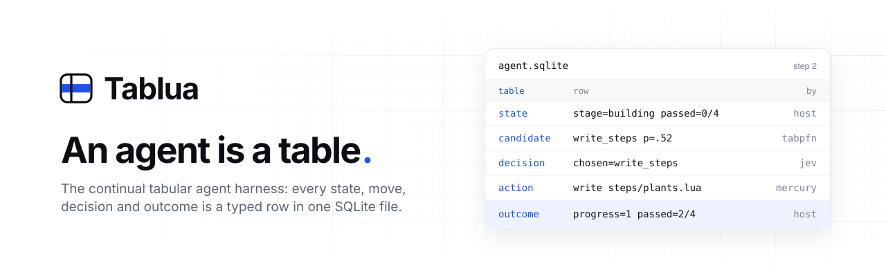
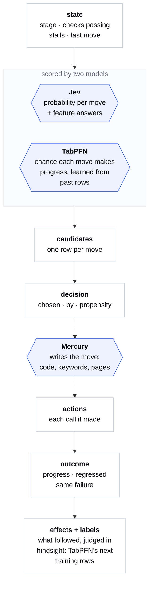
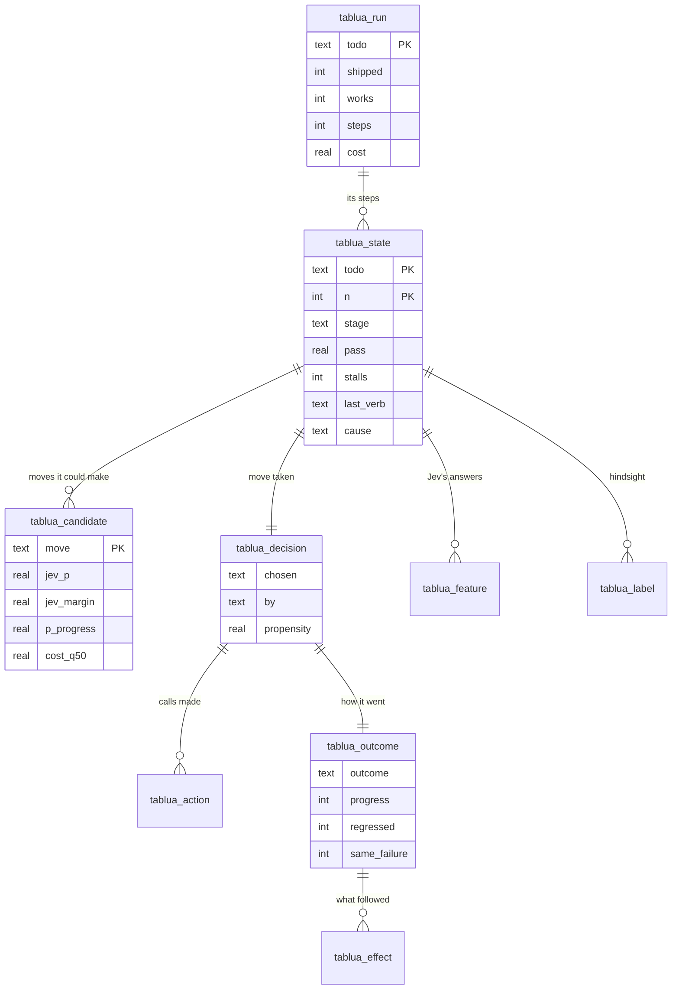
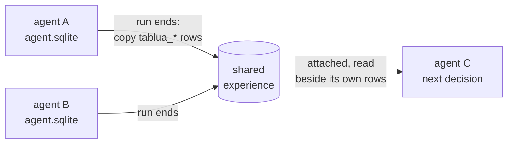

<p align="center">
  <a href="https://tablua.com"></a>
</p>

<p align="center">
  <a href="LICENSE"></a>
  
  
  
  <a href="https://tablua.com"></a>
  <a href="https://docs.tablua.com"></a>
</p>

# Tablua

> New here? Start with the docs: **[docs.tablua.com](https://docs.tablua.com)**.

**The continual tabular agent harness.** Tablua writes everything an agent does as typed rows in one SQLite file:
where the work stands, every move it could make and what each model said about it, the move it took and who
chose it, what that move did, and how the step turned out. A tabular foundation model, TabPFN, learns from those
rows which moves make progress. The agent improves from its own record, and from the records of other agents
it shares a file with.

Most agent harnesses keep their history as a transcript and their rules as prompt text. In Tablua both are tables.
You can query an agent's past like any other data, give it to a model trained for tables, and change its policy
by changing rows.

```sql
select s.stage, d.chosen, d.by, o.progress
from tablua_state s
join tablua_decision d using (todo, n)
join tablua_outcome  o using (todo, n)
where s.stalls >= 2;          -- what does the agent do when it is stuck, and does it work?
```

## The loop

Each step of an agent is one pass down this diagram, and the next step starts again from a new state row. Each
box is a row in the agent's file, and each model has one job.



| Model | Its job | Median call |
| --- | --- | --- |
| **Jev** (typed decisions) | Picks a move with a probability for each option, and answers feature questions about the state in the same call | 0.20 s |
| **TabPFN** (Prior Labs, 3.5 Fast) | Gives each move its chance of making progress, learned from past rows; ranks during building | 3.0 s |
| **Mercury** (Inception) | Fills in the move: writes the code, the tests, the keywords or the page, one unit at a time | 0.77 s |
| **The host** | Writes the state and outcome rows, runs the checks, records effects | milliseconds |

*Latencies are medians of 368 calls from production port traces. Toggle "Real time" on [tablua.com](https://tablua.com)
to watch a run at those speeds.*

## The tables

The agent's file is ordinary SQLite. Every table is named `tablua_*`, and the harness writes only to these
tables. They fall into three parts, told apart by their key:

- **The log**: what the agent did, keyed by run and step. Rows are only ever added.
- **The build**: what the agent is making, the app's files as rows, keyed by file: sections, units, tests,
  keywords, their calls and a Lua page's elements. Rows are replaced as files change.
- **The policy**: how the next decision is made: gates, fits, rankings. Keyed by neither.

They meet in `tablua_change`: each operation a step made on the build, kept in the log with columns that describe
the build. The log's core tables:



Other tables hold the rest of the agent's world:

- `tablua_fit` and `tablua_prediction`: TabPFN's fits and every prediction it made, so its record can be scored.
- `tablua_gate`: the hand-written rules still in force.
- `tablua_section`, `tablua_unit`, `tablua_test`, `tablua_keyword`, `tablua_call` and `tablua_link`: the program the
  agent is writing, kept as rows. `tablua_break` is a view of the links that point at nothing.
- `tablua_result`: every keyword of every test or task run, with its status, message and time.
  `tablua_task_record` is each task's record over its runs. A task is a test that does a job rather than checks
  one (Robot's `*** Tasks ***`): `robot.record` writes a passing test's run as one, run again with no model deciding.
- `tablua_control`: on a desktop, the controls on screen a step chose among.
- `tablua_term`: every command typed in the agent's terminal (`core/term`): its keys, exit code, time to its first
  output, and the programs the shell really ran (a bash `DEBUG` trace). `tablua_label` keeps each step's `further`
  (more tests passing than ever, or a failing test reaching further) and `safe` (nothing that passed was lost).

## How it learns

A training set is a `SELECT`. Each **head** is a question TabPFN answers about a step, using only the columns
known before Jev answers:

| Head | Question | Label comes from |
| --- | --- | --- |
| `progress` | Did this step help? | More checks passing, or a complete step that was not a change going nowhere |
| `ship` | Did its run ship an app that works? | `tablua_run` |
| `contrib` | Did it contribute to the app finally built? | Jev, reading the whole run afterwards (never an input at decision time) |
| `effect:<Keyword>` | Did this effect follow? (`Test Turned Green`, `Same Keyword Failing`, `Reached Further`…) | The harness's own telemetry |

**Shared experience.** When a run ends, its rows are copied into one shared file on the node, with each todo
renamed to `<computer>|<todo>` so no run joins another's. The next agent attaches that file and learns from every
agent before it. An agent with no past of its own still starts with one.



**Cheap by design.** One fit, cached on the server, serves many predictions. A run asks at most 20 times. A
state it has already ranked is ranked again without a call. The day's tokens are budgeted below the free tier.

## Policy as data

The rules that hold a move back are written once as Robot Framework tests, which a host keeps beside its moves.
Each is tagged with its gate's name and has a reason the harness can check against recorded runs:

```robot
*** Test Cases ***
Fixing the same failure again waits on thinking it through
    [Documentation]    because: fix_failure | 2+ stalls | Same Keyword Failing | more
    [Tags]    gate:stuck_fix
    Given Same Failure after 2 changes running
    When the last move was not think
    Then fix_failure is not offered
```

The evaluation measures every `because` line against the effects recorded across all runs. A gate
whose reason does not hold is the first to be retired, and a gate is only retired through an A/B test. The aim is
for the hand-written rules to shrink as the learned model takes over.

## The program as rows

A program is org plus Robot Framework (owner, 2026-10-05). Tablua's agent writes apps as [org](https://orgmode.org)
files with five kinds of section: Notes, Tests, Keywords, Code and Page. Org holds the plan and the code; the Tests
section holds the tests and tasks in [Robot Framework](https://robotframework.org)'s syntax, one `** Test:` or
`** Keyword:` heading per test and user keyword; the Keywords section holds the Lua keywords they call, declared as
`keyword("There is a plant ${name}", function(name) ... end)`. Each code block carries its language, so the output
can be any language the agent's computer runs.

```robot
*** Test Cases ***
Add a plant
    Type    Plant name    Fern
    Press    Add
    See    Fern
```

The harness keeps each file as rows: its sections, its code's units, each test and user keyword and every keyword
call they make, plus the links between them. A Lua block is cut into its top-level statements and its calls are
linked; a block in another language is kept whole until a scanner for it is added. Mercury edits one unit at a
time, each edit is an action row, and the compiled file is what runs and is tested. A call that no keyword answers
shows up in `tablua_break` before any test runs.

The tests run in portable Lua (`core/robot`), and every keyword's result is kept as a row (`tablua_result`): where
it sits in the test, its arguments, `PASS`, `FAIL`, `SKIP` or `NOT RUN`, why, and how long it took. For a failing
test the harness also keeps its reach, how many keywords passed before it failed, so a step that moves a failing
test further along is seen even when no more tests pass.

## Claims before code

A change is not called fixed, better or working until a claim says so and survives. Claims are Robot tests in
`.robot/claims/`, each with what checks it, the number that kills it, a `(red)` proof that the check can fail on rows
built to be wrong, and a prediction (`predict:holds@0.6`), committed before the run they measure. `luajit
.robot/run.lua` scores them against fetched runs: **holds**, **KILLED**, **broken** (failed before its check),
**BLIND** (its red proof passed too), or **unknown** (too few rows). A run counts only when its claims file was
committed unchanged, and each bet is scored once for calibration. `luajit .robot/mutate.lua .robot/mutations/*.lua`
breaks one rule at a time to show the tests can fail. `.robot/README.md` says how; `/claim` walks it.

## Embedding it

Tablua is native Lua and nothing else. A host embeds it with whatever Lua VM it has: LuaJIT,
Lua 5.4/5.5, Luerl or another. It reaches the world only through ports the host supplies: SQLite, the models, and a
computer that runs the agent's code. So an adopter's agents can write any language their computer runs.

```lua
local tablua = require("tablua")
local t = tablua.open(require("ports.sqlite").open("agent.sqlite"))

-- where the work stands, what could be done, what was done, how it went
t:state{ todo = "r1", n = 1, stage = "building", passed = 0, total = 4 }
t:candidates("r1", 1, { { move = "write_keywords", jev_p = 0.61 }, { move = "write_page", jev_p = 0.27 } })
t:decision{ todo = "r1", n = 1, chosen = "write_keywords", by = "jev" }
t:outcome{ todo = "r1", n = 1, verb = "write_keywords", outcome = "complete", passed = 2, total = 4 }

-- learn from every past step, and from other agents' runs
t:attach("shared", "experience.sqlite")
local train, labels = t:training("progress", { before = true })

-- or let the agent harness do all of it: TabPFN ranks the moves before Jev picks
local tabpfn = require("ports.tabpfn").new({ fetch = require("ports.curl").fetch }, { key = os.getenv("PRIORLABS_KEY") })
local learn = require("agent.learn").new{ tablua = t, tabpfn = tabpfn }
local ranked = learn:rank("step", { stage = "building", stalls = 2, n = 5 }, { "write_keywords", "rewrite", "think" })
```

The step loop (`core/agent`) is a state machine the host drives one step at a time. Nothing in it yields or
blocks, so a host can run thousands of agents, each a file and a stateless stepper.

## Where it stands

Tablua is in active development and is measured in the open, inside its own evaluation protocol: frozen code, 12
asks (four held out), several seeds and paraphrases, a page arm against a control arm, and continual-learning
**Gain**, an ordered stream with shared experience against a reset per ask.

- ✅ Typed rows for every step, written live, with no text parsing.
- ✅ Jev's fan-out features; TabPFN heads for progress, ship, hindsight contribution and effects.
- ✅ The harness learns only from Tablua's rows; shared experience holds them.
- ✅ The program as rows, edited one unit at a time; broken links as a view.
- 🔬 In an offline study of 4,515 build steps, progress was predictable from the state (AUROC 0.82 on asks it had not
  seen), and Jev was overconfident while building.
- 🔬 On Terminal-Bench 2.0 (October 2026), with a quantized 35B Qwen writing, overfull-hbox passed 1 of 33 trials; a
  control on older code did no better, so the writer was the limit, not the harness. The harness now keeps its rules
  there (no file it must not touch is touched, no host dies, a weakened test is refused), and its tabular model
  learns `further` rather than `complete`, which told moves apart (mean spread 0.23 against 0.08). Stronger writers
  are being measured.
- ⏳ Next: TabPFN deciding during building through A/B tests, retiring gates one at a time, and Gain with its
  confidence interval.

## What a host gives it

Tablua is the harness and nothing else. A host embeds it and gives each agent a computer to build on, a SQLite
file for its rows, and the ports to the models. The harness never names its host: what it knows of the computer
is the facts and the moves the host hands it, and what it keeps is the rows.

## Repository

| Path | What it is |
| --- | --- |
| `core/tablua` | The harness's tables, training queries, effects, hindsight, the program as rows |
| `core/robot` | The agent's tests in Robot Framework's syntax, parsed and run in Lua, every keyword's result kept |
| `core/term` | The agent's terminal: one tmux session driven by keystrokes, each command's screen and trace kept as rows |
| `core/agent` | The step loop: decide, rank, fill, record, learn |
| `core/ports` | Jev, Mercury, TabPFN and the other model ports, and `ports.sqlite` for a LuaJIT host |
| `.robot/` | Claims about the harness as Robot tests, their ledger, and mutation suites (see Claims before code) |
| `site/` | tablua.com and docs.tablua.com |

Every module has a unit test (`*_test.lua`). They run on LuaJIT and on Lua 5.5.

## License

Apache-2.0.
