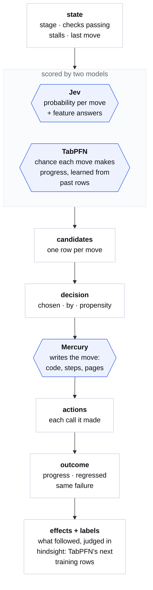
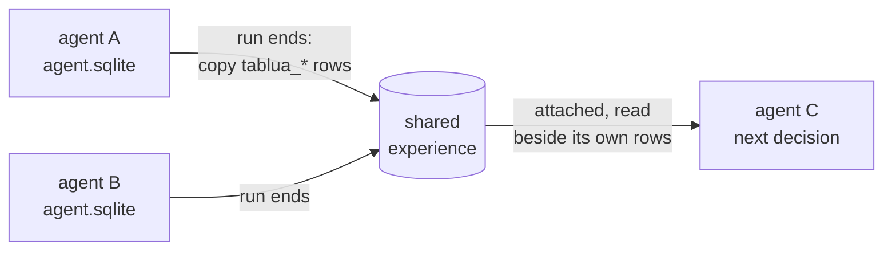

<p align="center">
  <a href="https://tablua.com"></a>
</p>

<p align="center">
  <a href="LICENSE"></a>
  
  
  
  
  <a href="https://tablua.com"></a>
  <a href="https://docs.tablua.com"></a>
</p>

# Tablua

> New here? Start with the docs: **[docs.tablua.com](https://docs.tablua.com)**.

**The continual tabular agent harness.** Tablua writes everything an agent does as typed rows in one SQLite file:
where the work stands, every move it could make and what each model said about it, the move it took and who
chose it, what that move did, and how the step turned out. A tabular foundation model, TabPFN, learns from those
rows which moves make progress. The agent improves from its own record, and from the records of other agents
it shares a file with.

Most agent harnesses keep their history as a transcript and their rules as prompt text. In Tablua both are tables.
You can query an agent's past like any other data, give it to a model trained for tables, and change its policy
by changing rows.

```sql
select s.stage, d.chosen, d.by, o.progress
from tablua_state s
join tablua_decision d using (task, n)
join tablua_outcome  o using (task, n)
where s.stalls >= 2;          -- what does the agent do when it is stuck, and does it work?
```

## The loop

Each step of an agent is one pass down this diagram, and the next step starts again from a new state row. Each
box is a row in the agent's file, and each model has one job.



| Model | Its job | Median call |
| --- | --- | --- |
| **Jev** (typed decisions) | Picks a move with a probability for each option, and answers feature questions about the state in the same call | 0.20 s |
| **TabPFN** (Prior Labs, 3.5 Fast) | Gives each move its chance of making progress, learned from past rows; ranks during building | 3.0 s |
| **Mercury** (Inception) | Fills in the move: writes the code, the steps or the page, one unit at a time | 0.77 s |
| **The host** | Writes the state and outcome rows, runs the checks, records effects | milliseconds |

*Latencies are medians of 368 calls from Arock's port traces. Toggle "Real time" on [tablua.com](https://tablua.com)
to watch a run at those speeds.*

## The tables

The agent's file is ordinary SQLite. Every table is named `tablua_*`, and the harness writes only to these
tables. These are the core ones:


Other tables hold the rest of the agent's world:

- `tablua_fit` and `tablua_prediction`: TabPFN's fits and every prediction it made, so its record can be scored.
- `tablua_gate`: the hand-written rules still in force.
- `tablua_section`, `tablua_unit`, `tablua_scenario`, `tablua_line` and `tablua_link`: the program the agent is
  writing, kept as rows. `tablua_break` is a view of the links that point at nothing.
- `tablua_control`: on a desktop, the controls on screen a step chose among.

## How it learns

A training set is a `SELECT`. Each **head** is a question TabPFN answers about a step, using only the columns
known before Jev answers:

| Head | Question | Label comes from |
| --- | --- | --- |
| `progress` | Did this step help? | More checks passing, or a complete step that was not a change going nowhere |
| `ship` | Did its run ship an app that works? | `tablua_run` |
| `contrib` | Did it contribute to the app finally built? | Jev, reading the whole run afterwards (never an input at decision time) |
| `effect:<Keyword>` | Did this effect follow? (`Scenario Turned Green`, `Same Line Failing`, `Step Broken`…) | The harness's own telemetry |

**Shared experience.** When a run ends, its rows are copied into one shared file on the node, with each task
renamed to `<computer>|<task>` so no run joins another's. The next agent attaches that file and learns from every
agent before it. An agent with no past of its own still starts with one.



**Cheap by design.** One fit, cached on the server, serves many predictions. A run asks at most 20 times. A
state it has already ranked is ranked again without a call. The day's tokens are budgeted below the free tier.

## Policy as data

The rules that hold a move back are written once as keyword scenarios (`priv/gates.org`). Each has a reason the
harness can check against recorded runs:

```gherkin
Scenario: fixing the same failure again waits on thinking it through
  # gate: stuck_fix
  Given Same Failure after 2 changes running
  When the last move was not think
  Then fix_failure is not offered
  # because: fix_failure | 2+ stalls | Same Line Failing | more
```

The evaluation measures every `because` line against the effects recorded across all runs. A gate
whose reason does not hold is the first to be retired, and a gate is only retired through an A/B test. The aim is
for the hand-written rules to shrink as the learned model takes over.

## The program as rows

Tablua's agent writes apps as [org](https://orgmode.org) files with five kinds of section: Notes, Feature, Steps,
Code and Page. The harness keeps each file as rows: its sections, each top-level Lua statement, each scenario and
each of its lines, plus the links between them. Mercury edits one unit at a time, each edit is an action row, and
the compiled file is what runs and is tested. A step that refers to a missing definition shows up in
`tablua_break` before any test runs.

## Embedding it

The harness is portable Lua. The same code runs on LuaJIT, Lua 5.4/5.5 and Lua on the BEAM. It reaches SQLite
and the models only through ports the host supplies.

```lua
local tablua = require("tablua")
local t = tablua.open(require("arock-log.ffi").open("agent.sqlite"))

-- where the work stands, what could be done, what was done, how it went
t:state{ task = "r1", n = 1, stage = "building", passed = 0, total = 4 }
t:candidates("r1", 1, { { move = "write_steps", jev_p = 0.61 }, { move = "write_page", jev_p = 0.27 } })
t:decision{ task = "r1", n = 1, chosen = "write_steps", by = "jev" }
t:outcome{ task = "r1", n = 1, verb = "write_steps", outcome = "complete", passed = 2, total = 4 }

-- learn from every past step, and from other agents' runs
t:attach("shared", "experience.sqlite")
local train, labels = t:training("progress", { before = true })

-- or let the agent harness do all of it: TabPFN ranks the moves before Jev picks
local tabpfn = require("ports.tabpfn").new({ fetch = require("ports.curl").fetch }, { key = os.getenv("PRIORLABS_KEY") })
local learn = require("agent.learn").new{ tablua = t, tabpfn = tabpfn }
local ranked = learn:rank("step", { stage = "building", stalls = 2, n = 5 }, { "write_steps", "rewrite", "think" })
```

The step loop (`core/agent`) is a state machine the host drives one step at a time. Nothing in it yields or
blocks, so a host can run thousands of agents, each a file and a stateless stepper.

## Where it stands

Tablua is in active development and is measured in the open, inside its own evaluation protocol: frozen code, 12
asks (four held out), several seeds and paraphrases, a page arm against a control arm, and continual-learning
**Gain**, an ordered stream with shared experience against a reset per ask.

- ✅ Typed rows for every step, written live, with no text parsing.
- ✅ Jev's fan-out features; TabPFN heads for progress, ship, hindsight contribution and effects.
- ✅ The harness learns only from Tablua's rows; shared experience holds them.
- ✅ The program as rows, edited one unit at a time; broken links as a view.
- 🔬 In an offline study of 4,515 build steps, progress was predictable from the state (AUROC 0.82 on asks it had not
  seen), and Jev was overconfident while building.
- ⏳ Next: TabPFN deciding during building through A/B tests, retiring gates one at a time, and Gain with its
  confidence interval.

## It runs on Moss

Every Tablua agent has its own computer, **🌿 Moss**: a process on the BEAM, its disk one SQLite file (the same
file its rows live in), a shell of its own, a headless browser, a mailbox, and Lua as its one language. It is
written in Elixir and Lua, with no WebAssembly and no native code an agent can reach. A computer sleeps on its
disk and wakes in milliseconds, so a single node holds many of them.

Arock, the Mac and iPhone apps and the server that runs thousands of agents' computers, is
built on Tablua.

## Repository

| Path | What it is |
| --- | --- |
| `core/tablua` | The harness's tables, training queries, effects, hindsight, the program as rows |
| `core/agent` | The step loop: decide, rank, fill, record, learn |
| `core/ports` | Jev, Mercury, TabPFN and the other model ports |
| `core/arock-log` | The append-only log under everything an agent does |
| `priv/lua/world` | The agent's world on its computer: moves, gates, facts, edits |
| `priv/gates.org` | The gates, as checkable scenarios |
| `lib/moss` | Moss, the computer (Elixir) |
| `lua/`, `browser/` | moss-lua (the Lua VM on the BEAM) and moss-browser |
| `site/` | tablua.com |

```sh
mix setup
mix test                                  # Moss, the harness's Lua, and the gates
mix run bench/computers.exs 20000 400     # how many computers a node holds
```

## License

Apache-2.0.
